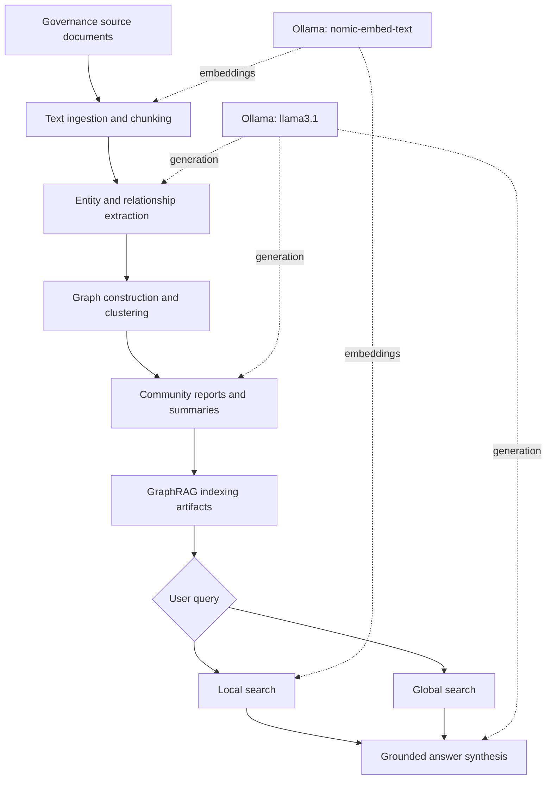

# OPENVERSE Graph-RAG: Governance Framework for European Virtual Worlds

> **Research prototype · release candidate · not a hosted public service**
>
> Public distribution and the final software licence require approval from the relevant OPENVERSE project and institutional rights holders. This repository contains implementation scripts and configuration, **not** the original document corpus or precomputed graph artifacts.

## Overview

OPENVERSE Graph-RAG is a research prototype exploring graph-based retrieval-augmented generation for questions about ethical, legal, intellectual-property and governance issues in European virtual worlds. Its intended users include researchers, virtual-world developers, SMEs and governance stakeholders.

The uploaded implementation adapts **Microsoft GraphRAG** rather than implementing a graph-retrieval engine entirely from scratch. It provides entry-point scripts for indexing and querying, a set of customised extraction and community-report prompts, configuration for locally served language models, and monkey patches that adapt embedding and global-search behaviour.

The broader OPENVERSE research framework describes governance-oriented reasoning over curated documents. **This code snapshot does not independently establish the full corpus composition, quantitative evaluation results, deployment status or completeness of the research framework.**

## Architecture



*Conceptual workflow based on the supplied source files and GraphRAG configuration. It is not a validated deployment diagram.*

### Pipeline at a glance

1. **Ingest:** text documents are loaded from `ragtest/input/` (excluded from this release).
2. **Chunk:** the supplied configuration sets a chunk size of 300 and overlap of 100.
3. **Extract:** customised prompts guide entity and relationship extraction; the current configuration lists `organization`, `person`, `geo` and `event` as entity types.
4. **Organise:** Microsoft GraphRAG builds and clusters the extracted graph and prepares community reports.
5. **Index:** generated artifacts are written to timestamped output directories.
6. **Query:** `query.py` exposes local and global search modes, with custom embedding and global-search patches.

## Repository contents

| Path | Purpose |
| --- | --- |
| `index.py` | CLI wrapper for the GraphRAG indexing pipeline; applies the local embedding patch. |
| `query.py` | CLI wrapper for local and global search; applies query-time patches. |
| `monkey_patch.py` | Overrides selected Microsoft GraphRAG methods to use Ollama embeddings and adapt global-search processing. |
| `ragtest/settings.yaml` | Research configuration for models, input, indexing, storage, prompts and search. |
| `ragtest/prompts/` | Custom prompts for entity extraction, claims, description summarisation and community reports. |
| `Visualize.ipynb` | Experimental notebook for exploring indexed graph data. Requires generated artifacts and additional dependencies. |
| `requirements.txt` | Original environment snapshot, including a specific Microsoft GraphRAG Git commit. |

The repository intentionally excludes the source corpus, `.env` files, caches, `.parquet` artifacts, model weights and generated output. These exclusions limit the ability to reproduce original experimental outputs without the relevant inputs.

## Requirements

- Python and Git; use a separate virtual environment.
- A local [Ollama](https://ollama.com/) service accessible on the configured endpoint.
- Sufficient RAM, disk space and processing capacity for indexing; requirements depend on corpus size and models.
- Internet access during initial package and model installation.

**Compatibility warning:** `requirements.txt` is a historical, fully pinned environment snapshot and installs Microsoft GraphRAG from commit `75735bd1036b00abfe17a951383392049cb72947`. The monkey patches depend on internal GraphRAG APIs and may fail with newer versions. Python-version and platform compatibility have **not** been verified for this release.

## Installation (provisional)

```bash
# Clone once you have access to the repository
git clone https://github.com/AbNeil/OPENVERSE-GraphRAG.git
cd OPENVERSE-GraphRAG

python3 -m venv .venv
source .venv/bin/activate   # macOS/Linux
python -m pip install --upgrade pip
python -m pip install -r requirements.txt
```

The requirements snapshot may not install successfully on all systems. If installation fails, record the Python version, operating system and full error output before changing dependency versions; indiscriminate upgrades can break the custom patches.

Install and start Ollama separately, then obtain the configured models:

```bash
ollama pull llama3.1
ollama pull nomic-embed-text
ollama list
```

Ensure Ollama is running. The supplied settings use `http://localhost:11434/v1` for chat completion and `http://localhost:11434/api` for embeddings. The embedding monkey patches call the Ollama Python client directly.

## Configuration

The supplied `ragtest/settings.yaml` is a research configuration, not a production-ready template. Key settings in the reviewed snapshot:

| Setting | Reviewed value |
| --- | --- |
| Chat model | `llama3.1` |
| Embedding model | `nomic-embed-text` |
| Chat endpoint | `http://localhost:11434/v1` |
| Embedding endpoint | `http://localhost:11434/api` |
| Input format | UTF-8 `.txt` files |
| Input directory | `ragtest/input/` (relative to the project root used by GraphRAG) |
| Chunk size / overlap | 300 / 100 |
| Community maximum cluster size | 10 |
| Graph embedding / UMAP | Disabled in supplied settings |

The configuration includes `api_key: NONE` for local model use. Do not replace this with real credentials in tracked files. Use environment variables or an ignored local configuration if remote services are introduced.

**Paths are relative to the GraphRAG root.** The examples below use `--root ./ragtest` so the input, prompt, cache and output paths resolve inside that directory.

## Running the prototype (unverified examples)

1. Create `ragtest/input/` and add only text documents you are authorised to process.
2. Review the model settings and confirm that Ollama is responding.
3. Index the documents:

```bash
mkdir -p ragtest/input
python index.py --root ./ragtest
```

4. After successful indexing, try local or global search:

```bash
python query.py --root ./ragtest --method local "What governance issues arise from biometric identity in virtual worlds?"
python query.py --root ./ragtest --method global "How do privacy, transparency and digital ownership intersect in virtual-world governance?"
```

These are **usage examples inferred from the supplied CLI**, not tested commands. Depending on the GraphRAG revision and output layout, you may need to provide `--config` and/or `--data` explicitly. The original research corpus and index artifacts are not included.

## Local versus global search

- **Local search** is designed for questions tied to particular entities, relationships and nearby evidence in the indexed graph.
- **Global search** aggregates information from community reports to address broader themes across the indexed corpus.

Both modes depend on the source documents, graph extraction quality, model behaviour and retrieval configuration. Generated responses should be checked against primary sources before use in policy, compliance or legal decisions.

## Customisation in this snapshot

The `monkey_patch.py` module modifies private/internal GraphRAG implementation methods. In the supplied code it:

- Redirects indexing-time embedding generation to `ollama.embeddings`.
- Redirects query-time embedding generation to `ollama.embeddings`.
- Replaces part of the global-search map response handling.

These adaptations are **version-sensitive** and should be treated as experimental. They do not establish compatibility with the current upstream GraphRAG release.

## Visualisation notebook

`Visualize.ipynb` is an exploratory notebook for inspecting graph-derived data. It references Microsoft GraphRAG internals, LanceDB and `yfiles_jupyter_graphs`. The latter is **not listed in the supplied requirements snapshot**, and the notebook requires index artifacts that are intentionally excluded from this repository. Notebook execution has not been validated; inspect its paths and outputs before running or distributing it.

## Data, provenance and responsible use

The source corpus and derived knowledge graph are not published in this repository. Some governance documents may have separate licences or redistribution restrictions. Before releasing data or graph artifacts, verify the rights associated with each source and any generated derivatives.

The prototype is intended for research and exploratory governance intelligence. It is **not legal advice**, an authoritative interpretation of EU regulation, or a substitute for specialist review. Generated answers may be incomplete or inaccurate. Source attribution, traceability and systematic evaluation should be verified for each deployment.

## Known limitations

- Full end-to-end indexing and querying have not been independently tested from this archive.
- The original dataset and generated graph artifacts are excluded.
- The GraphRAG dependency is pinned to an older Git commit; internal monkey patches may break on upgrades.
- The environment snapshot is large and not yet minimised to direct dependencies.
- The visualisation notebook has at least one dependency not declared in `requirements.txt`.
- No reproducible benchmark, test suite, continuous integration workflow or service API is supplied in the reviewed snapshot.
- The repository does not itself provide a hosted endpoint or establish a post-project maintenance commitment.

## OPENVERSE project context and attribution

This research prototype was developed in the context of the **OPENVERSE** project, with contributions associated with the **Insight Centre for Data Analytics / University of Galway**. The related technical framework and project deliverables describe its use for ethical and legal governance questions in European virtual worlds.

**Project attribution and contributors:** final wording, author list, institutional ownership and funding acknowledgement should be confirmed with the project coordinator and rights holders before public release.

The implementation also incorporates and adapts components of [Microsoft GraphRAG](https://github.com/microsoft/graphrag). The supplied `index.py` and `query.py` retain Microsoft copyright/MIT notices. Upstream licences and attribution requirements must be preserved.

## Licence and release status

**No project-specific licence is granted by this README.** The applicable OPENVERSE/University of Galway licence, including any proposed AGPL-3.0 release, must be confirmed by the authorised rights holders. Do not add a `LICENSE` file or change the repository to public based solely on this draft.

## Suggested citation

Until a formal software release, DOI and author-approved citation are available, cite the relevant OPENVERSE deliverable or technical report and identify the repository URL and commit hash used. Do not invent a DOI or versioned release identifier.

## Maintenance and contributions

This repository is a research snapshot, not a guaranteed operational service. Bug reports and reproducibility feedback may be submitted through GitHub Issues after the repository owner enables that workflow. There is no confirmed service-level agreement, support commitment or model-update schedule.
